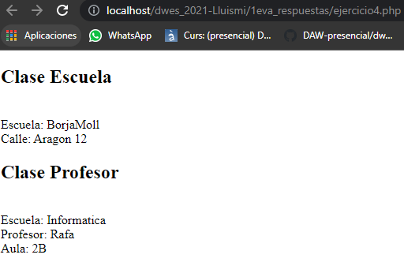

EJERCICIO 4:

a) Sí. En el ejemplo detallado en el ejercicio4.php, he puesto de ejemplo dos clases: Escuela y Profesor. Profesor extiende de escuela pero sin embargo sólo tiene el constructor y la herencia de la clase escuela. He puesto de ejemplo dos elementos en pantalla diferenciados. En el primero caso, instancio escuela y le añado un name, le añado una propiedad denominada "calle" la cual le defino que sea "aragon 12". Cuando pintamos los datos accediendo a las propiedades $escuela->name y $escuela->calle, me pinta el predeterminado y el añadido por la función mágica __set();

Cuando instancio al hijo, en este caso le paso el name y el nombre del profesor pero, además, creo una propiedad mediante $profesor->aula = '2B' la cual establezco una nueva propiedad que es su aula y le adjudico la 2B. Cuando pinto al Profesor, me pinta el name de la escuela que le he pasado por constructor al heredar de Escuela y además me pinta el nombre del profesor y su aula.

b) En principio en herencias siempre se recomienda usar una visibilidad protegida debido a que sólo la herencia pueda acceder la propiedad del padre.                                                                                                                                                                                                                           

Ejercicio 5